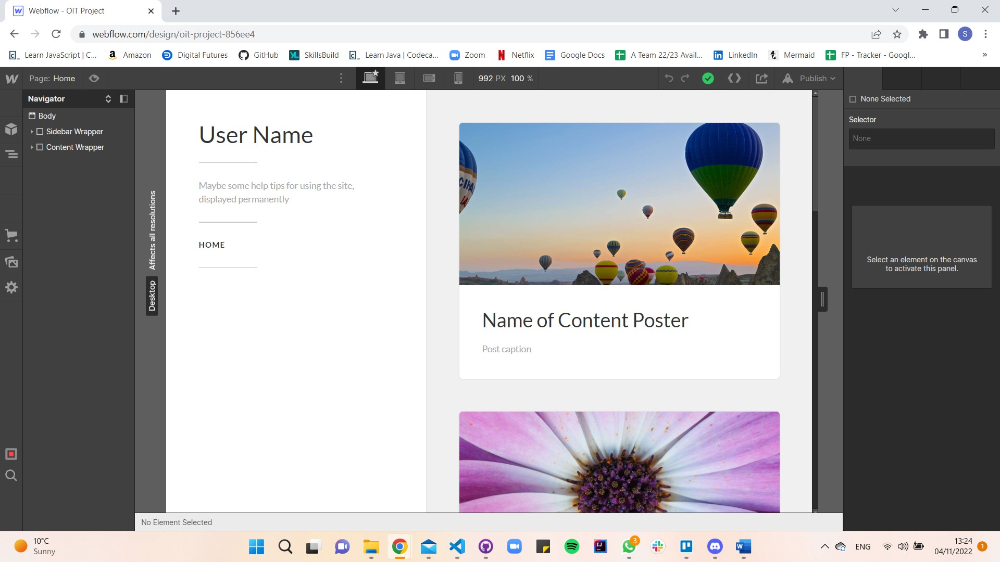
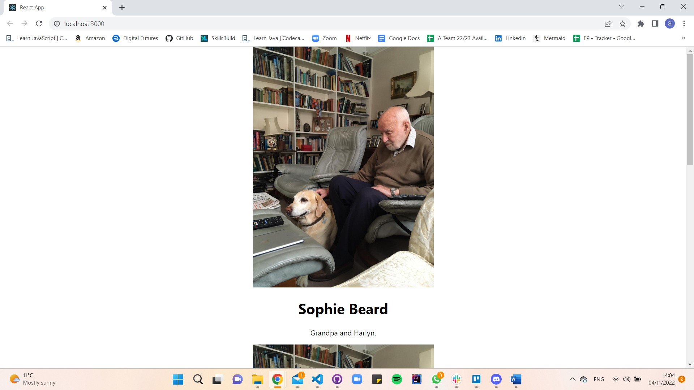

# OIT-Project

The aim of this project is to create an application that makes Instagram more accessible for users with disabilities by simplifying the user interface so that users can interact and view Instagram content more easily. 

## Front End Development Options

I have chosen to use the ReactJS library to build and create the user interface. The pros of using this method are the fast user interface, reusable code, single page applications can be created, and only the parts of the library that are needed can be extracted. Some potential issues could be that this requires specialist knowledge to use it effectively, and I will be unable to perform 'business logic' actions within the application. 

## Building an app with React. 

- [X] Start with a mock. 
- [X] Break the UI into a component hierarchy. 
- [ ] Build a Static version in React.
- [ ] Identify the minimal (but complete) representation of UI state. 
- [ ] Identify where your state should live. 
- [ ] Add inverse data flow. 

### Start with a Mock

My mock was developed using Webflow. It is a basic example of what I would like the application to look like. 

### The Component Hierarchy

Each component in the mock is taken out and given a name to help identify components which should only do one thing. 

- User Name
- Instructions and tips on using the site. 
- Image
- Image name
- Image caption

## User Story

As a user, I want to be able to access an online application that allows me to view a simplified Instagram feed, so that I can use it more easily

### Epic Breakdown - Front End

As the PRESENTATIONAL LAYER, I want to be able to request data from the BUSINESS LAYER, so that I can display it.

#### Further Epic Breakdown - Front End

1. As the PRESENTATIONAL LAYER, I want to be able to display pictures in a 'feed' UI, so that the user is able to see all the pictures.

- [X] Get a ReactJS application up and running.
- [X] Build and Serve and Application. 
- [X] Display and image on the webpage.

2. As the PRESENTATIONAL LAYER, I want to be able to display each picture with a user name, so that I can see who has posted the picture.

- [X] Each picture is displayed with a username. 

3. As the PRESENTATIONAL LAYER, I want to be able to display each picture with a caption, so that I can read what each picture is about.

## Step-By-Step

### Get a ReactJS application up and running. 

A ReactJS application was set up using a the node package extractor called create-react-app. Once the installation of files was completed, the application was launched in the browser to see it running.The browser opened at http://localhost:3000/ with the following screen: 

### Build and serve and application. 

I produced a production-ready set of code for the skeleton application. This will make bundles of the HTML, CSS and JavaScript needed to efficiently deploy the application. 

### Display an Image on the webpage. 

First I modified the App.js file to return to the basic code. I created a Photo1 component and imported this into the App.js file. When the application is run it displays Image1. 

### Display each picture with a username. 

A username component was created. This was then imported in the the App.js file. When the application is run, it displays Image1, with the username. 

### Display each picture with a caption. 

A caption component was created. This was then imported in the the App.js file. When the application is run, it displays Image1, with the username, and the caption. So far, all of the elements have been hard coded. The website looks as shown: 

